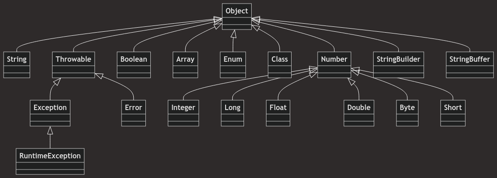

## What is Polymorphism?
- Poly means many, morphism means forms
## Types of Polymorphism

### Compile Time Polymorphism(Static Polymorphism)
- To achieve it we use: ***METHOD OVERLOADING***
- It is handled by compiler.
### Run Time Polymorphism(Dynamic Polymorphism)
- To achieve it we use: ***METHOD OVERRIDING***
- It is handled by JVM.

## Method Overloading
- Multiple methods with same name.
- Both methods in same class.
- Different Arguments (Any of the following)
	- Numbers
	```java
	class BankAccount {
    // Method with one argument
    public void createAccount(String accountHolder) {
        System.out.println("Account created for: " + accountHolder);
    }

    // Method with two arguments
    public void createAccount(String accountHolder, double initialDeposit) {
        System.out.println("Account created for: " + accountHolder + " with initial deposit: $" + initialDeposit);
    }
}

public class Main {
    public static void main(String[] args) {
        BankAccount account = new BankAccount();
        account.createAccount("Gautam Raj");
        account.createAccount("Gautam Raj", 5000);
    }
}
    ```
	- Sequence
	```java
	class Rectangle {
    // Method where length comes first
    public void calculateArea(int length, int width) {
        System.out.println("Area (length first): " + (length * width));
    }

    // Method where width comes first
    public void calculateArea(double width, int length) {
        System.out.println("Area (width first): " + (length * width));
    }
}

public class Main {
    public static void main(String[] args) {
        Rectangle rect = new Rectangle();
        rect.calculateArea(10, 5);   // length first
        rect.calculateArea(5.0, 10); // width first (using double for width)
    }
}

	```
	- Type of Arguments
	```java
	class Calculator {
    // Method to add two integers
    public int add(int a, int b) {
        return a + b;
    }

    // Method to add two floating-point numbers
    public double add(double a, double b) {
        return a + b;
    }
}

public class Main {
    public static void main(String[] args) {
        Calculator calc = new Calculator();
        System.out.println("Integer sum: " + calc.add(5, 10));          // integer addition
        System.out.println("Double sum: " + calc.add(5.5, 10.25));      // double addition
    }
}
	```
## Method Overriding
- Multiple methods with same name.
- Both methods in same class.
- Same Arguments (All of the following should be exact same)
	- Numbers
	- Sequence
	- Type of Arguments
- Inheritance
	```java
	class Employee {
    public void calculateSalary(int baseSalary) {
        System.out.println("Employee salary: " + baseSalary);
    }
}

	class Manager extends Employee {
	    // Overriding method with the same number of arguments
	    @Override
	    public void calculateSalary(int baseSalary) {
	        int bonus = 5000;
	        System.out.println("Manager salary: " + (baseSalary + bonus));
	    }
	}
	
	public class Main {
	    public static void main(String[] args) {
	        Employee emp = new Employee();
	        emp.calculateSalary(30000); // Calls Employee's method
	
	        Manager mgr = new Manager();
	        mgr.calculateSalary(30000); // Calls Manager's method (overridden)
	    }
	}
	```

### Uses of Method Overriding
- It allows a subclass or child class to provide a specific implementation of a method that is already provided by one of its super classes or parent classes.
	- The implementation in the subclass overrides(replaces) the implementation in the super class by providing a method that has same name, same parameters or signature, and same return type as the method in the parent class.
## A more practical example involving both overloading and overriding
```java
// Base class for general shopping
class Shopping {
    
    // Overloaded method - purchase a single item
    void purchase(String itemName) {
        System.out.println("Purchased item: " + itemName);
    }
    
    // Overloaded method - purchase multiple items
    void purchase(String[] itemNames) {
        System.out.println("Purchased items: ");
        for(String item : itemNames) {
            System.out.println(item);
        }
    }
    
    // Overloaded method - purchase with a coupon
    void purchase(String itemName, String couponCode) {
        System.out.println("Purchased item: " + itemName);
        System.out.println("Applied coupon: " + couponCode);
    }
}

// Subclass that overrides the purchase methods to apply discounts
class DiscountShopping extends Shopping {

    // Overriding method - purchase a single item with a discount
    @Override
    void purchase(String itemName) {
        System.out.println("Purchased item with discount: " + itemName);
    }

    // Overriding method - purchase multiple items with a discount
    @Override
    void purchase(String[] itemNames) {
        System.out.println("Purchased items with discount: ");
        for(String item : itemNames) {
            System.out.println(item);
        }
    }

    // Overriding method - purchase with a coupon and additional discount
    @Override
    void purchase(String itemName, String couponCode) {
        System.out.println("Purchased item: " + itemName);
        System.out.println("Applied coupon: " + couponCode);
        System.out.println("Additional discount for premium member.");
    }
}

public class ShoppingSystem {
    public static void main(String[] args) {
        Shopping normalShopping = new Shopping();
        DiscountShopping premiumShopping = new DiscountShopping();
        
        System.out.println("---- Normal Shopping ----");
        // Normal shopping for a single item
        normalShopping.purchase("Laptop");
        
        // Normal shopping for multiple items
        String[] items = {"Laptop", "Headphones", "Mouse"};
        normalShopping.purchase(items);
        
        // Normal shopping with a coupon
        normalShopping.purchase("Smartphone", "DISCOUNT10");
        
        System.out.println("\n---- Premium Member Shopping ----");
        // Premium shopping for a single item
        premiumShopping.purchase("Laptop");
        
        // Premium shopping for multiple items
        premiumShopping.purchase(items);
        
        // Premium shopping with a coupon
        premiumShopping.purchase("Smartphone", "PREMIUM20");
    }
}
```
## Important Questions - Method Overloading
- **Can we achieve method overloading by changing the return type of method only?**
	- No, Because of ambiguity
- **Can we overload main() method?**
	- Yes, we can have any number of main methods in a class by method overloading. This is because JVM always calls main() method which receives string array as arguments only.
- **Method Overloading and Type Promotion**
	- ***AUTOMATIC PROMOTION*** happens in polymorphism
		- One type is promoted to another implicitly if no matching datatype is found.
		 
- **Different cases of Type Promotion**
	- *CASE 1*
	```java
	package polymorphism;  
  
	class One{  
	    void show(int a){  
	        System.out.println("int method");  
	    }  
	    void show(String a){  
	        System.out.println("String method");  
	    }  
	}  
	public class AutomaticPromotion1 {  
	    public static void main(String[] args) {  
	        One obj1 = new One();  
	        obj1.show(5); //int method  
	        obj1.show("sss"); //string method  
	        obj1.show('a'); // automatically promoted to int  
	    }  
	}
	```
	- *CASE 2*
	```java
	package polymorphism;  
  
	class One{  
	    void show(Object a){  
	        System.out.println("Object method");  
	    }  
	    void show(String a){  
	        System.out.println("String method");  
	    }  
	}  
	public class AutomaticPromotion1 {  
	    public static void main(String[] args) {  
	        One obj1 = new One();  
	        obj1.show(5); //Object method  
	        obj1.show("sss"); //string method  
	        obj1.show('a'); // Object method
	    }  
	}
	```
	- Object is the parent class of all the classes in java.
		- While resolving Overloaded methods, Compiler will always give precedence for the child type argument compared to the parent type argument.
	- *CASE 3
	```java
	package polymorphism;
	
	class One {
	    // Method that accepts a StringBuffer
	    void show(StringBuffer a) {
	        System.out.println("String Buffer method");
	    }
	
	    // Method that accepts a String
	    void show(String a) {
	        System.out.println("String method");
	    }
	}
	
	public class AutomaticPromotion1 {
	    public static void main(String[] args) {
	        One obj1 = new One();
	        
	        // Calling the method with a String, this matches the `show(String a)` method
	        obj1.show("sss"); // Output: String method
	
	        // Calling the method with a StringBuffer, this matches the `show(StringBuffer a)` method
	        obj1.show(new StringBuffer("abx")); // Output: String Buffer method
	
	        /* Calling with null causes ambiguity since both String and StringBuffer can accept null This will result in a compile-time error because the compiler can't decide which method to call*/
	        
	        // obj1.show(null);  // Compile-time error: ambiguous method call
	
	        // Compile-time error because there's no `show` method that accepts an int
	        // Java will attempt to auto-box the primitive `5` into an `Integer`, but there's no `show(Integer)` method
	        // obj1.show(5);  // Compile-time error: no suitable method found for show(int)
	
	        // Compile-time error because there's no `show` method that accepts a char
	        // Java will attempt to auto-box the primitive `'a'` into a `Character`, but there's no `show(Character)` method
	        // obj1.show('a');  // Compile-time error: no suitable method found for show(char)
	    }
	}
	```

- *CASE 4*
```java
package polymorphism;  
  
class One{  
    void show(int a,float b){  
        System.out.println("int float method");  
    }  
    void show(float a,int b){  
        System.out.println("float int method");  
    }  
}  
public class AutomaticPromotion1 {  
    public static void main(String[] args) {  
        One one = new One();  
        one.show(10,20.5f); //int float method  
        one.show(10.5f,20); //float int method  
        // one.show(10,20); //Error : As int can be promoted to float, there is an ambiguity to choose between show(int, float) and show(float, int).    }  
}
```

```java
package polymorphism;  
  
class One{  
    void show(String a,float b){  
        System.out.println("string float method");  
    }  
    void show(float a,int b){  
        System.out.println("float int method");  
    }  
}  
public class AutomaticPromotion1 {  
    public static void main(String[] args) {  
        One one = new One();  
        one.show("10",20.5f); //string float method  
        one.show(10.5f,20); //float int method  
        one.show(10,20);  //float int method  
        // one.show(20,10.5f); //Error: As float can't be converted to int : No suitable method 
    }   
}
```

- *CASE 5*
	- ***varargs***: The varargs allow the method to accept zero or multiple arguments. Before varargs either we used overloaded methods or take an array as the method parameter but it was not considered good because it leads to the maintenance problem. If we don't know how many arguments we will have to pass in this method, varags is a better approach.
	- In general, varargs gets least priority i.e. if no other method matched, then only vararg method will get the chance.
```java
package polymorphism;  
  
class One{  
    void show(int a,float b){  
        System.out.println("int float method");  
    }  
    void show(int... a){  
        System.out.println("varargs method");  
    }  
}  
public class AutomaticPromotion1 {  
    public static void main(String[] args) {  
        One one = new One();  
        one.show();  
        one.show(10); //varargs method  
        one.show(10,20); //int float method  
        one.show(10,20.3f); //int float method  
        one.show(10,20,30); // varargs method  
        // one.show(10.0f,20.2f,22.6f); //Error: As float can't be promoted to int    }  
}
```

## Important Questions - Method Overloading
- **Does overriding method must have same return type?**
	- Before 1.4 version: return type should have been same
	- But from Java 5 (1.5) onwards: The rule has been relaxed to allow covariant return types.
	- An overriding method is allowed to have a return type that is a subclass of the return type declared in the superclass method.
	
 
- Example 1:  CORRECT
```java
package polymorphism;  
  
public class CovariantReturns {  
    public static void main(String[] args) {  
        Test1 t1 = new Test1();  
        Test2 t2 = new Test2();  
    }  
}  
class Test1{  
    Object show(){  
        System.out.println("Test-1 show");  
        return null;    }  
}  
class Test2 extends Test1{  
    String show(){  
        System.out.println("Test-2 show");  
        return null;    }  
}
```

- Example 2: INCORRECT
```java
package polymorphism;  
  
public class CovariantReturns {  
    public static void main(String[] args) {  
        Test1 t1 = new Test1();  
        Test2 t2 = new Test2();  
    }  
}  
class Test1{  
    String show(){  
        System.out.println("Test-1 show");  
        return null;    }  
}  
class Test2 extends Test1{  
    Object show(){  
        System.out.println("Test-2 show");  
        return null;    }  
}
```
- `'show()' in 'polymorphism. Test2' clashes with 'show()' in 'polymorphism. Test1'; attempting to use incompatible return type`

- **Overriding and Access Modifiers**
	When overriding methods in Java, there are important rules regarding access modifiers. The fundamental principle is that an overriding method can be more accessible, but not less accessible, than the method it overrides. Here's a detailed explanation:

	1. Access Modifier Hierarchy (from most restrictive to least): private → default (package-private) → protected → public
	2. Overriding Rules:
	    - An overriding method can use the same access modifier as the overridden method.
	    - An overriding method can use a less restrictive access modifier than the overridden method.
	    - An overriding method cannot use a more restrictive access modifier than the overridden method.
	1. Examples:
	    - If a superclass method is declared as protected, the overriding method in the subclass can be declared as protected or public, but not private or default.
	    - If a superclass method is declared as public, the overriding method in the subclass must also be public.
	2. Compile-time Errors:
	    - Attempting to override a method with a more restrictive access modifier will result in a compile-time error.
	3. Rationale:
	    - This rule ensures that a subclass object can be used wherever a superclass object is expected, maintaining the principle of substitutability (Liskov Substitution Principle).

```java
class SuperClass {
    private void privateMethod() {
        System.out.println("SuperClass: private method");
    }

    void defaultMethod() {
        System.out.println("SuperClass: default method");
    }

    protected void protectedMethod() {
        System.out.println("SuperClass: protected method");
    }

    public void publicMethod() {
        System.out.println("SuperClass: public method");
    }
}

class SubClass extends SuperClass {
    // Cannot override private methods
    private void privateMethod() {
        System.out.println("SubClass: private method");
    }

    // Override with same access (default)
    @Override
    void defaultMethod() {
        System.out.println("SubClass: default method");
    }

    // Override with more permissive access (protected to public)
    @Override
    public void protectedMethod() {
        System.out.println("SubClass: public method (overriding protected)");
    }

    // Must use same access (public)
    @Override
    public void publicMethod() {
        System.out.println("SubClass: public method");
    }

    // This would cause a compile-time error:
    // @Override
    // private void publicMethod() { }
}
```
- **Overriding and Exception Handling**
	When overriding methods in Java, there are specific rules governing how exceptions can be declared in the overriding method compared to the overridden method. These rules ensure type safety and maintain the contract established by the superclass method. Let's break this down into two main rules:
		1. **Rule 1: Overriding a Method that Doesn't Throw an Exception** When the overridden method in the superclass doesn't declare any exceptions:
    - The overriding method in the subclass can declare unchecked exceptions (RuntimeException and its subclasses, or Error and its subclasses).
    - The overriding method cannot declare any checked exceptions.
    - The overriding method may choose not to declare any exceptions at all.Rationale: This preserves the contract of the superclass method, ensuring that code which calls the superclass method doesn't unexpectedly have to handle new checked exceptions when using a subclass object.
2. **Rule 2: Overriding a Method that Throws an Exception** When the overridden method in the superclass declares one or more exceptions:
    - The overriding method can declare the same exceptions as the superclass method.
    - The overriding method can declare exceptions that are subclasses of the exceptions declared in the superclass method.
    - The overriding method can declare fewer exceptions than the superclass method.
    - The overriding method can choose not to declare any exceptions at all.
    - The overriding method cannot declare new checked exceptions or broader checked exceptions (superclasses of the exceptions declared in the superclass method).Rationale: This allows the overriding method to refine the exception handling, either by handling some exceptions internally or by throwing more specific exceptions, while still maintaining the original contract.

## Abstraction vs Encapsulation
**Abstraction**
- Abstraction is detail hiding(implementation hiding)
- Data Abstraction details with exposing the interface to the user and hiding the details of the implementation.
**Encapsulation**
- Encapsulation is data hiding (information hiding)
- Encapsulation groups together data and methods that act upon the data.
