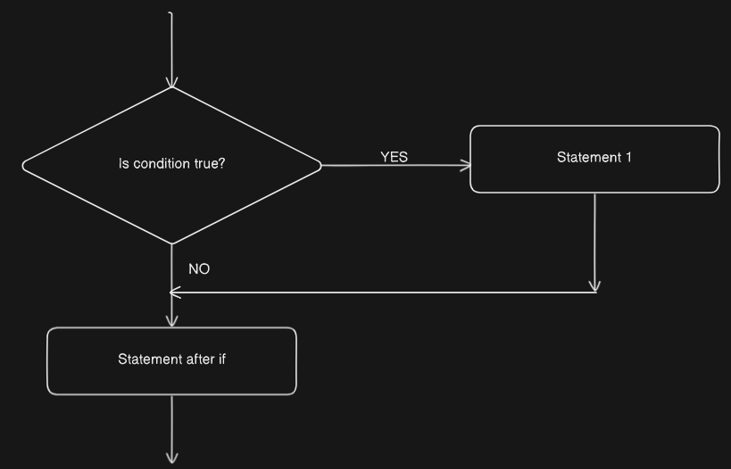
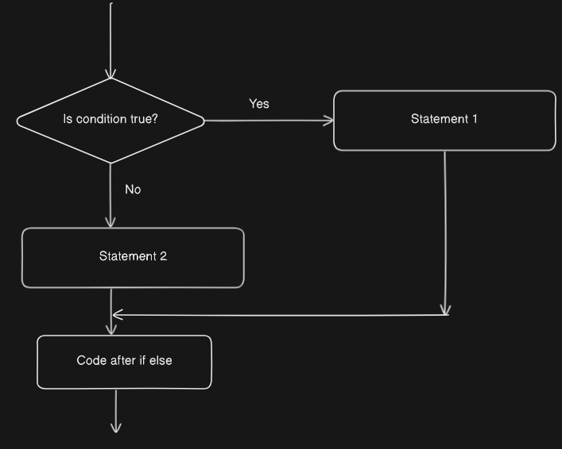
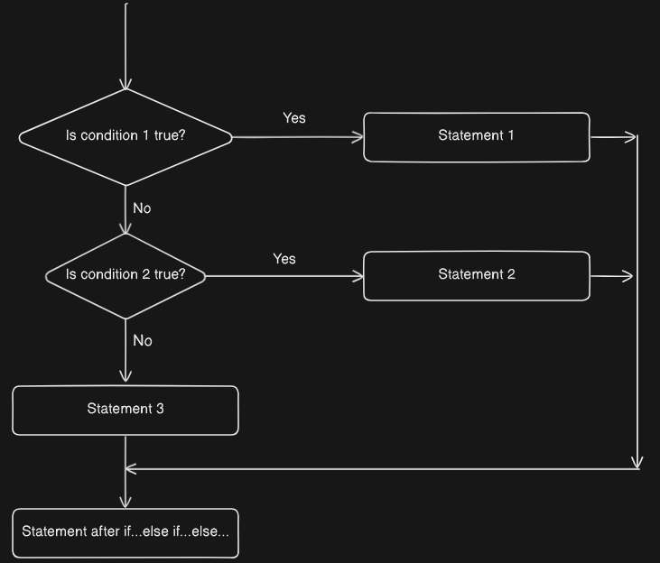

# Conditionals
- Conditionals are programming language constructs that perform different computations or actions depending on the condition.

## `if` statement
- An if statement executes a block of code only if specified condition is met.
### Syntax
```java
if(condition){
	//body of if
}
// code after if
```
- If condition is true - The body of if statement executes then code after if
- If condition is false - The body of if statement is skipped then code after if
- Code after is executes regardless the condition.
### Flowchart

### Example
**Q. Print positive if a number is greater than 0**

*CODE*
```java
class Test{
    public static void main(String[] args) {
        int num = 10;
        if(num>0){
            System.out.println(num+" is positive");
        }
        System.out.println("Code after if");
    }
}
```
*OUTPUT*
```
10 is positive
Code after if
```

*CODE*
```java
class Test{
    public static void main(String[] args) {
        int num = -2;
        if(num>0){
            System.out.println(num+" is positive");
        }
        System.out.println("Code after if");
    }
}
```
*OUTPUT*
```
Code after if
```

## `if...else...` statement
- An if statement can have an optional else clause. The else statement executes if the condition in the if statement evaluates to be false.
### Syntax
```java
if(condition){
	//body of if
}else{
	//body of else
}
// code after if
```
- If condition is true - The body of if statement executes, the body of else is skipped then code after if is executed.
- If condition is false - The body of if statement is skipped, the body of else is executed then code after if is executed.
- Code after is executes regardless the condition.
### Flowchart

### Example
**Q. Print positive if a number is greater than 0 and negative if a number is less than 0**

*CODE*
```java
class Test{
    public static void main(String[] args) {
        int num = 10;
        if(num>0){
            System.out.println(num+" is positive");
        }else{
            System.out.println(num+" is negative");
        }
        System.out.println("Code after if else");
    }
}
```
*OUTPUT*
```
10 is positive
Code after if
```
*CODE*
```java
class Test{
    public static void main(String[] args) {
        int num = -4;
        if(num>0){
            System.out.println(num+" is positive");
        }else{
            System.out.println(num+" is negative");
        }
        System.out.println("Code after if else");
    }
}
```
*OUTPUT*
```
-4 is negative
Code after if else
```

**Our code has a logical error**
- When we give the value of number as 0, it shows it is negative.
*CODE*
```java
class Test{
    public static void main(String[] args) {
        int num = 0;
        if(num>0){
            System.out.println(num+" is positive");
        }else{
            System.out.println(num+" is negative");
        }
        System.out.println("Code after if else");
    }
}
```
*OUTPUT*
```
0 is negative
Code after if else
```
- The solution to this is to use `if...else if...else`

## `if...else if...else...` statement

- The `if...else...` statement is used to execute a block of code among two alternatives.
- However, if we need to make a choice between more than two alternatives, we use `if..else if...else...` statement
### Syntax
```java
if(condition){
	//body of if
}else if(condition){
	//body of else if
}else{
	//body of else
}
// code after if else if else
```

### Flowchart

### Example
**Q. Print positive if a number is greater than 0 and negative if a number is less than 0 and "zero" if a  number is equal to 0**

*CODE*
```java
class Test{
    public static void main(String[] args) {
        int num = 10;
        if(num>0){
            System.out.println(num+" is positive");
        }else if(num<0){
            System.out.println(num+" is negative");
        }else{
             System.out.println(num+" is zero");
        }
        System.out.println("Code after if...else if...else...");
    }
}
```
*OUTPUT*
```
10 is positive
Code after if...else if...else...
```
*CODE*
```java
class Test{
    public static void main(String[] args) {
        int num = -2;
        if(num>0){
            System.out.println(num+" is positive");
        }else if(num<0){
            System.out.println(num+" is negative");
        }else{
             System.out.println(num+" is zero");
        }
        System.out.println("Code after if...else if...else...");
    }
}
```
*OUTPUT*
```
-2 is negative
Code after if...else if...else...
```
*CODE*
```java
class Test{
    public static void main(String[] args) {
        int num = 0;
        if(num>0){
            System.out.println(num+" is positive");
        }else if(num<0){
            System.out.println(num+" is negative");
        }else{
             System.out.println(num+" is zero");
        }
        System.out.println("Code after if...else if...else...");
    }
}
```
*OUTPUT*
```
0 is zero
Code after if...else if...else...
```

## Nested if statement
- Nested if statements are conditional statements placed inside other if statements. This structure allows us to check multiple conditions in a hierarchical manner, where the execution of one condition depends on the truth of a previous condition

### Syntax
```java
if(condition1){
	if(condition2){
		if(condition3){
			...
		}
	}
}
```

### Example
**Q: Write a Program to determine the admission status of a college applicant based on the following criteria:** 
1. The applicant's score on an entrance exam.
2. Whether the applicant participates in extracurricular activities. 
3. Whether the applicant has a recommendation letter. 
4. The quality of the applicant's interview. 
The program should use nested if statements to evaluate the conditions in the following order: 
- If the applicant's score is 80 or higher: 
	-  If the applicant participates in extracurricular activities: 
		- If the applicant has a recommendation letter: 
			- If the interview quality is 'excellent':
				Print "Admitted with Scholarship" 
			- Otherwise: 
				Print "Admitted without Scholarship" 
		- Otherwise: Print "Admitted but needs recommendation letter"
	- Otherwise: Print "Admitted but encouraged to join extracurricular activities" 
- If the applicant's score is below 80: 
	Print "Not Admitted" 
Use the following sample data to test your program: 
- Score: 85 
- Extracurricular activities: True 
- Recommendation letter: True 
- Interview quality: 'excellent'

*CODE*
```java
public class AdmissionDecision {
    public static void main(String[] args) {
        // Variables
        int score = 85;
        boolean extracurricular = true;
        boolean recommendation = true;
        String interview = "excellent";

        // Nested if statements
        if (score >= 80) {
            if (extracurricular) {
                if (recommendation) {
                    if (interview.equals("excellent")) {
                        System.out.println("Admitted with Scholarship");
                    } else {
                        System.out.println("Admitted without Scholarship");
                    }
                } else {
                    System.out.println("Admitted but needs recommendation letter");
                }
            } else {
                System.out.println("Admitted but encouraged to join extracurricular activities");
            }
        } else {
            System.out.println("Not Admitted");
        }
    }
}

```
*OUTPUT*
```
Admitted with Scholarship
```

## Multiple Ifs
- There can be situations where multiple independent conditions need to be checked, and each condition requires a separate action. 
- This situation might arise when the conditions are not mutually exclusive and can be true simultaneously. 
- For instance, in a game, we might want to apply multiple power-ups to a player based on the items they collect.
### Example
**Q: Write a Program  where we might want to apply multiple power-ups to a player based on the items they collect.** 

*CODE*
```java
public class GamePowerUps {
    public static void main(String[] args) {
        // Variables
        boolean hasSpeedBoost = true;
        boolean hasShield = false;
        boolean hasDoubleDamage = true;
        boolean hasExtraLife = true;

        // Conditional statements
        if (hasSpeedBoost) {
            System.out.println("Speed boost applied!");
        }
        if (hasShield) {
            System.out.println("Shield activated!");
        }
        if (hasDoubleDamage) {
            System.out.println("Double damage activated!");
        }
        if (hasExtraLife) {
            System.out.println("Extra life granted!");
        }
    }
}
```
*OUTPUT*
```
Speed boost applied!
Double damage activated!
Extra life granted!
```
### Explanation 
- In this example, each if statement checks an independent condition: 
	- **Speed Boost**: Applied if the player collects the speed boost item. 
	- **Shield**: Activated if the player collects the shield item. 
	- **Double Damage**: Activated if the player collects the double damage item. 
	- **Extra Life**: Granted if the player collects the extra life item. 
- Why `else...if..` and `else` Are Not Suitable Here 
	- **Independence of Conditions**: Each power-up is independent of the others. Using elif or else would imply that only one of these conditions should be true at a time, which is not the case here. 
	- **Simultaneous Conditions**: Multiple power-ups can be active simultaneously. Using `else..if..` or `else` would prevent this by allowing only one block of code to execute